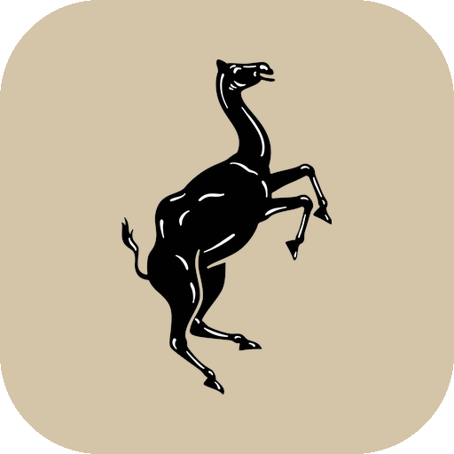

<p align="center">
  
</p>

<h1 align="center">Dubai World Cup 2026 — Interactive Heritage Journey</h1>

<p align="center">
  A 30th-anniversary event experience for the Dubai World Cup: follow a heritage
  trail through six Emirati crafts, dress your Arabian horse companion as you go,
  capture it in AR, and race in <strong>Gallop Mania</strong>.
  <br /><br />
  <a href="https://wildcamelhypermedia.github.io/Dubai-World-Cup-2026-WebApp/"><strong>▶ Live demo</strong></a>
  ·
  <a href="https://wildcamelhypermedia.github.io/Dubai-World-Cup-2026-WebApp/game/">Gallop Mania (race game)</a>
</p>

---

> [!NOTE]
> **This branch is a static demo.** The real application is a full-stack
> product built for live event operation; what is deployed here is a
> self-contained, backend-free version of it for GitHub Pages, so the
> experience can be tried without any infrastructure. Nothing here talks
> to a server — no accounts, no analytics, no data leaves the browser.

## The full application

In production the app runs as a complete event platform with an
**Express + PostgreSQL (Drizzle ORM) backend**:

- **Registration & login** — visitors sign up with name, mobile and email;
  identity is confirmed with **one-time codes (OTP)** sent on signup and
  login, and sessions are managed server-side. A "skip as guest" path
  creates an anonymous participant that can be upgraded to a full
  registration later.
- **Server-verified station unlocks** — each craft station at the venue has
  a printed QR code; scanning it is validated by the backend, which enforces
  valid codes and issues one-time unlock tokens per participant.
- **Persistent journey state** — horse choice, gear customizations, points,
  unlocked stations, AR captures and shares are written to the database, so
  a participant can continue on any device.
- **Admin dashboard** — a PIN-protected `/admin` area with live participation
  stats, participant search and activity timelines, and printable QR sheets
  for the stations.
- **Asset pipeline** — the 2,184 horse/gear combination images are generated
  offline and served from object storage behind caching headers.
- **Race leaderboard** — Gallop Mania scores post to the backend for a global
  event leaderboard.

## What this demo changes

Every server dependency is replaced with a client-side equivalent, feature
for feature:

| In production | In this static demo |
|---|---|
| Registration + OTP login, server sessions | Guest-only entry: a local `crypto.randomUUID()` participant id |
| Backend-validated QR codes + unlock tokens | Client-side station-code map |
| Journey state in PostgreSQL | `localStorage` |
| Combos served from object storage | 2,184 pre-rendered transparent `.webp` files shipped with the site |
| Global race leaderboard API | Per-device `localStorage` leaderboard |
| Admin dashboard | Removed |

Everything else — the trail, the customization system, the AR capture, the
bilingual UI, the game — is the production experience, unchanged.

## The experience

1. **Begin the journey** as a guest and pick one of three Arabian horses.
2. **Visit craft stations** on the heritage trail — Al Talli, Sadu, Leather,
   Pottery and Al Khous — unlocking each with its station code
   (at the live event these come from QR codes; for the demo:
   `TALLI30`, `SADU30`, `SADDLE30`, `POTTERY30`, `ALKHOUS30`, `SILK30`).
3. **Dress your horse** at each station. Every combination of gear is a
   pre-rendered transparent image, so the horse composites over live video
   and camera backgrounds.
4. **Capture in AR** — camera + horse overlay + share card with badges.
5. **Race in Gallop Mania** — a standalone 3D (three.js) racing game mounted
   at [`/game/`](https://wildcamelhypermedia.github.io/Dubai-World-Cup-2026-WebApp/game/):
   name your horse, tap to run, hold to gallop, three laps against the field.

The app is bilingual (English / العربية) and installable as a PWA.

## Stack

- **App** — Vite · React 19 · TypeScript · wouter · Tailwind · framer-motion ·
  i18next · `vite-plugin-pwa` (Workbox)
- **Game** — separate Vite + React + three.js app, built with
  `BASE_PATH=/Dubai-World-Cup-2026-WebApp/game/` and shipped as static files
  under `client/public/game/` (source: the
  [`gallop-mania`](https://github.com/WildCamelHyperMedia/DRC-Wild-Camel/tree/gallop-mania)
  branch of DRC-Wild-Camel)
- **Hosting** — GitHub Pages via `actions/deploy-pages`

## Development

```bash
npm install
npm run dev        # dev server on :5000 (served under /Dubai-World-Cup-2026-WebApp/)
npm run build      # static build -> dist/public (+ 404.html SPA fallback)
npm run preview    # serve the production build locally
npm run check      # typecheck
```

Deployment is automatic: every push to `pages-demo` runs
[`deploy-pages.yml`](.github/workflows/deploy-pages.yml), which builds and
publishes `dist/public` to GitHub Pages.

## Repo notes

- `client/` — the app (source in `client/src`, static assets in `client/public`)
- `client/public/images/combos/` — the 2,184 horse/gear combination webps
  (alpha-preserving, re-encoded from the production RGBA sources)
- `client/public/game/` — the built Gallop Mania sub-app. The service worker
  deliberately ignores this path (`navigateFallbackDenylist`) so the app shell
  never intercepts game navigations.
- Deep links work on Pages through the `404.html` SPA fallback; camera capture
  requires HTTPS, which `github.io` provides.

---

<p align="center">© Wild Camel HyperMedia · Dubai World Cup 30th Anniversary</p>
